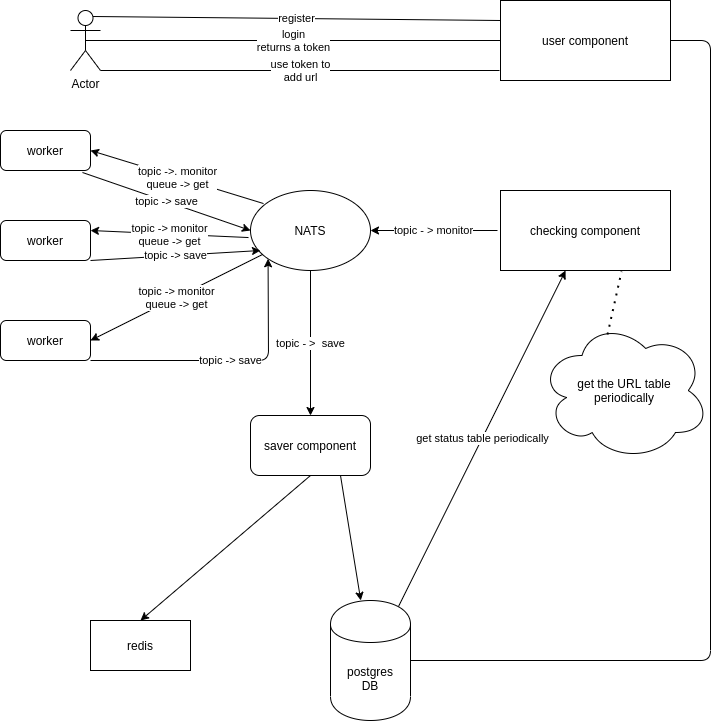

## Introduction
Well, well, well, I have the same project in my repository named HTTP_monitoring which does exactly the same thing, <br/>
that project started to become larger and larger which was really hard to maintain that was when my friend and teacher<br/>
[Parham Alvani](https://github.com/1995parham) suggested to change the project to smaller microservices that were much<br/>
easier to maintain, here is how I want to break the project to smaller projects


## User repository
This repository is only responsible for creating and running the endpoints Register, Login and add 

## Saver repository
In the begging saver should make the tables in the database

## Server repository
This repository get the url table periodically and publishes each URL which should be checked to the nats.

## Checker repository
This repository gets the URLs which should be checked from nats, checks their status and publishes the status to nats<br/>
again, we have more than one instance if this project running

## Run
Components of the project use the same services for example user, saver and server all need to connect to postgres so I<br/>
have just one docker-compose in this repository, to run the project first of all run this docker-compose and then do the<br/>
following:<br/>
1. Run the docker-compose<br/>
2. Create the tables in the postgres container, to do this run below command in the directory that saver repository is<br/>
```sh
$ go run main.go migrate
```
3. User component should be up and running to handle requests
4. Run the saver component
```sh
$ go run main.go server
```
5. Run the checker component
6. Run the server component

Now we can send request to the APIs,<br/>
Register
```sh
$ curl -X POST -d '{"Email": "elahe.dstn@gmail.com", "Password": "XXXX"}' 
-H 'Content-Type: application/json' 127.0.0.1:8080/register
```
Login
```sh
$ curl -X POST -d '{"Email": "elahe.dstn@gmail.com", "Password": "XXXX"}' 
-H 'Content-Type: application/json' 127.0.0.1:8080/login
```
This returns a token
```sh
$ curl -X POST -d '{"URL": "https://www.google.com", "Period": 2}' 
-H 'Content-Type: application/json' -H 'Authorization: token' 127.0.0.1:8080/url
```
## Creating tables
This was somehow a challenge in my code so I decided to write about it.At first I used raw SQL code in my code but<br/>
obviously it's not a good idea cause it needs so much hard code then I used gorm package but I could not write all<br/>
the SQL commands I wanted using gorm like "IF NOT EXISTS" then I got familiar with [migrate](https://github.com/golang-migrate/migrate),<br/>
this way I can write any SQL code I want and there is no SQL coding in between my codes.Maintaining code will be easier<br/>
too, to create migration sql files I ran the commands below:<br/>
```sh
$ migrate create -ext sql name_of_file
```